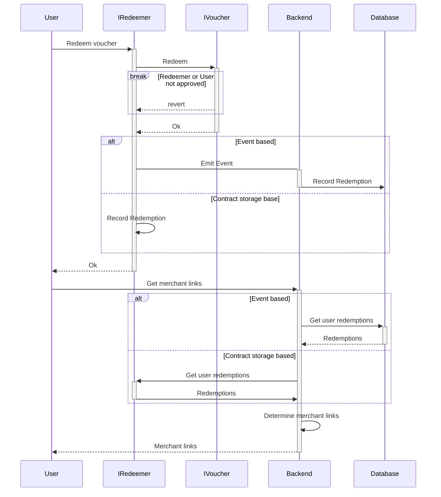

# Redeemable Vouchers

The responsibility of vouchers is to use internal book-keeping (e.g. burning the token, token property, etc.) to prevent double spending.

## Emission

Voucher tokens can be emitted via direct or claimable airdrops.
Vouchers are freely tradeable. 

## Redemption flow

Redeeming vouchers is facilitated via redeemer contracts (see e.g. `ISingleRedeemer`) that can redeem a given `IVoucher` token on behalf of the holder.
This requires a trusted setup, i.e. we preapprove redeemers to burn a voucher.

Each redeemer contract corresponds to a good that can be obtained through a redemption e.g. merch, other NFTs, etc.
This allows to have multiple redemption options for the same voucher. 
Or the other way around, have the same redemption for multiple different voucher tokens.

In it's most basic form redeemers just emit an event that will be picked up through `hydrant` and trigger a burn of the voucher token.
So redeemers do not necessarily need any internal bookkeeping, which allows a very gas-efficient redemption.
Since the event-listening infrastructure is not ready yet, another contract-storage based redeemer has been implemented that will be used in the interim. 

Since the logic for redeemers and vouchers will probably not change significantly for future drops, we can think about efficient deployments via clones in a next step.

